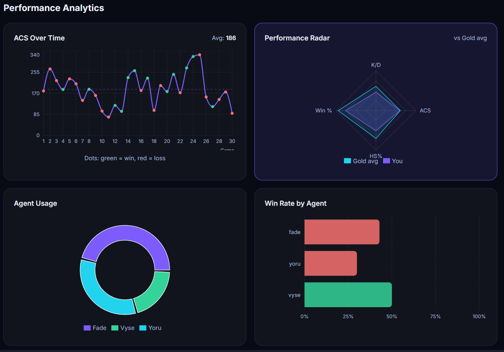
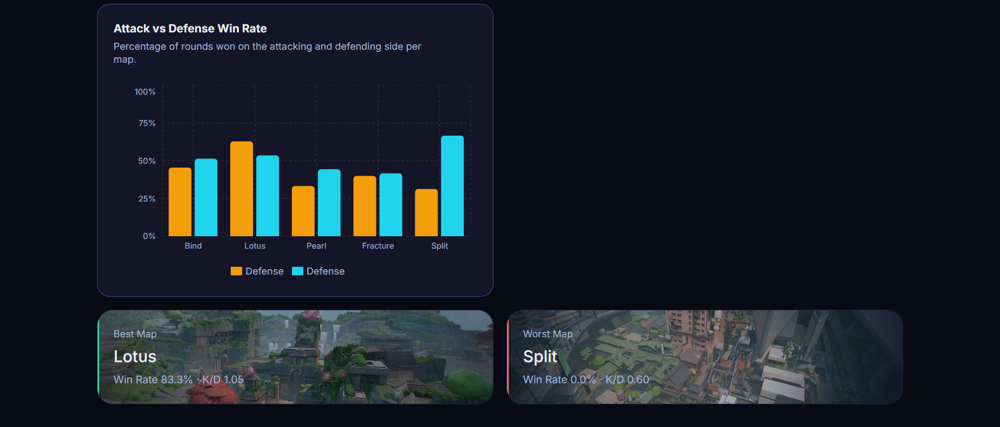
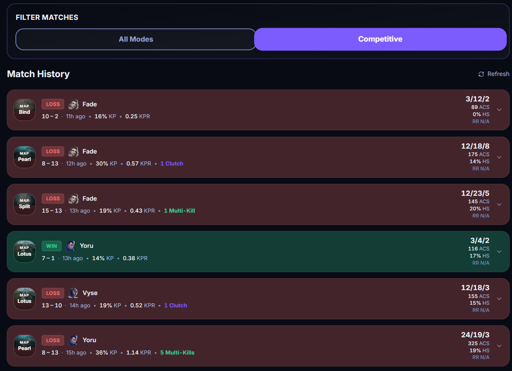
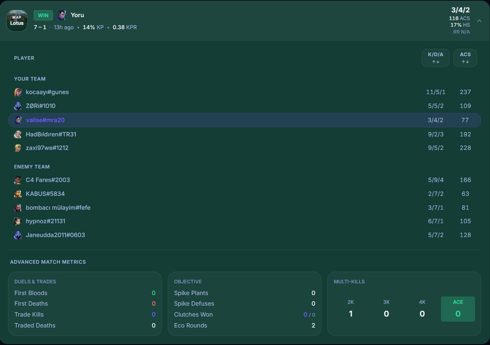
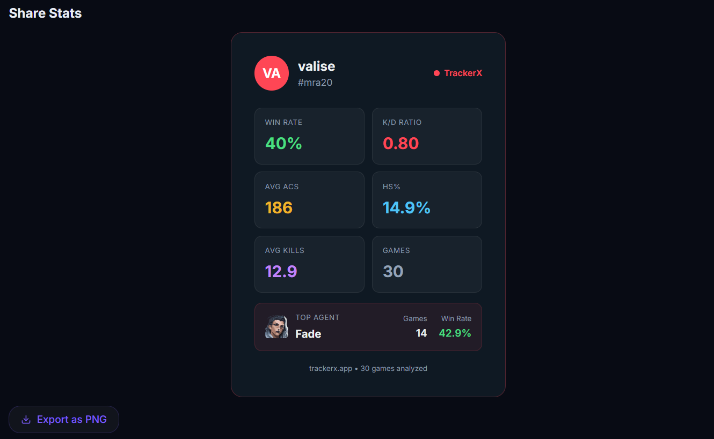

# TrackerX

  
  
  
  

  A high-performance VALORANT stats tracker. Deep performance analytics, visual trends, match filtering, and AI-ready data exports. All in one place.

### Hero Preview

  

---

## Overview

TrackerX is built for VALORANT players who want fast, accurate insight into their game. It pulls match data from the Henrik API, normalizes everything into a consistent shape, caches it aggressively using Supabase to prevent rate limiting, and presents it through clean charts, a live dashboard, and detailed match history with no bloat.

## Features

| Feature                   | Description                                                                                                                                                               |
| :------------------------ | :------------------------------------------------------------------------------------------------------------------------------------------------------------------------ |
| **Player Search**         | Look up any Riot ID across NA and EU. Recent searches are saved locally for quick access.                                                                                 |
| **Performance Dashboard** | Live snapshot of K/D, ACS, win rate, headshot %, kill participation (KP%), and kills per round (KPR).                                                                     |
| **Match History**         | Expandable match cards with full scoreboard, map, agent, and round count. Lazy-loads additional pages on demand.                                                          |
| **Advanced Analytics**    | Deep dive into match performance including first bloods, trade kills, traded deaths, spike plants, defuses, clutches, eco rounds, and a visual multi-kill breakdown.      |
| **Match Type Filter**     | Toggle between All Modes and Competitive to isolate ranked performance. Stats and charts update instantly without refetching.                                             |
| **Performance Charts**    | Visual analytics including ACS trend lines, agent win rate distributions, playtime pie charts, and a performance radar benchmarked against your rank tier.                |
| **AI-Ready Data Export**  | Export a highly structured JSON containing overall stats, per-agent breakdowns, per-map win rates, and deep round-by-round insights (trades, economy, multi-kills).       |
| **Share Card**            | Generates a downloadable PNG stat card with your top 6 stats and top agent spotlight. Always reflects the current match pool.                                             |
| **Dark / Light Mode**     | Full theme support. Preference is persistent across sessions.                                                                                                             |
| **Intelligent Caching**   | Uses **Supabase** as a robust caching layer for match histories and raw API payloads, heavily mitigating API rate limits and providing instantaneous load times.          |

---

## Feature Showcase

### Performance Dashboard

  

Live snapshot of your stats: K/D, ACS, win rate, headshot %, kill participation, and more. Always calculated from the currently loaded match pool.

---

### Performance Charts & Analytics

  

  

Visual analytics including ACS trend line, agent win rate distribution, agent playtime pie chart, KAST trend, and a performance radar benchmarked against your rank tier.

---

### Match History & Advanced Stats

  

  

Expandable match cards showing full scoreboards and advanced metrics. Click any match to reveal a beautiful grid breaking down your Duels & Trades (First Bloods, Trade Kills), Objective impact (Plants, Defuses, Clutches), and a clean visual counter for your Multi-Kills (2K, 3K, 4K, ACE).

---

### Data Export

  

Export your match data as highly structured JSON. Choose between All Modes or Competitive-only exports. The payload includes granular round-by-round insights (economy, trade kills, multi-kills) perfect for feeding into AI analysis tools or custom scripts.

---

### Share Card

  

Generate a downloadable PNG stat card showcasing your top 6 stats and top agent spotlight. Perfect for sharing on socials or analyzing offline.

---

## Tech Stack

### Frontend

- **Framework:** Next.js 16 (App Router for pages, Pages Router for API routes)
- **Styling:** Tailwind CSS v4
- **Animations:** Framer Motion v12
- **Icons:** Lucide React

### Data & State

- **Data Fetching:** TanStack React Query v5
- **State:** Zustand v5
- **Charts:** Recharts v3
- **Database/Cache:** Supabase

### Utilities

- **Image Export:** html-to-image